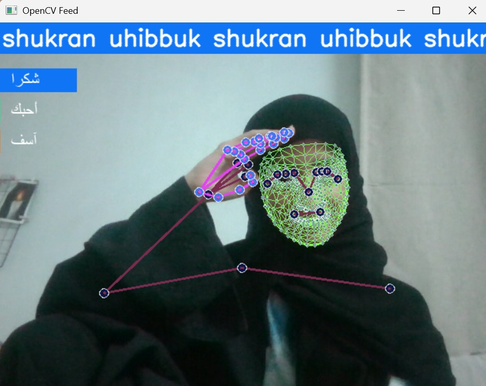
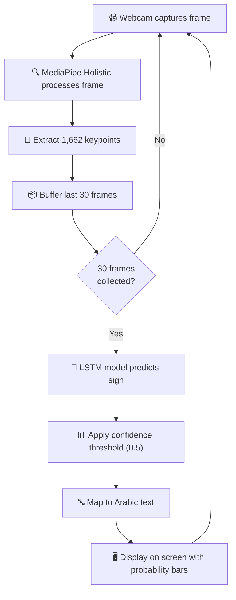

<div align="center">

# 🤟 Arabic Sign Language Translator
### Real-Time Action Detection Using LSTM & MediaPipe

[](https://python.org)
[](https://tensorflow.org)
[](https://mediapipe.dev)
[](https://opencv.org)
[](LICENSE)

<br>

A deep learning system that translates **Arabic sign language gestures** into text in real-time using a webcam. The model detects body, hand, and face keypoints via **MediaPipe Holistic** and classifies temporal action sequences using a multi-layer **LSTM neural network**.

<br>



<br>

*Real-time detection showing recognized signs with Arabic labels and confidence probability bars*

</div>

---

## 📑 Table of Contents

- [Overview](#-overview)
- [Features](#-features)
- [Architecture](#-architecture)
- [Dataset](#-dataset)
- [Model Performance](#-model-performance)
- [Project Structure](#-project-structure)
- [Installation](#-installation)
- [Usage](#-usage)
- [How It Works](#-how-it-works)
- [Future Improvements](#-future-improvements)
- [Acknowledgements](#-acknowledgements)

---

## 🔍 Overview

Sign language is the primary communication method for millions of deaf and hard-of-hearing individuals across the Arab world. However, a significant communication barrier exists between sign language users and the broader community.

This project addresses that gap by building a **real-time Arabic sign language translator** that:

1. Captures live video from a webcam
2. Extracts **1,662 body keypoints** per frame (pose, face, hands) using MediaPipe Holistic
3. Feeds temporal sequences of keypoints into a trained **LSTM model**
4. Outputs the detected Arabic sign with its **Arabic translation** displayed on screen

---

## ✨ Features

| Feature | Description |
|---------|-------------|
| 🎥 **Real-Time Detection** | Live webcam feed with instant sign recognition |
| 🧠 **LSTM Deep Learning** | Temporal sequence classification capturing motion dynamics |
| 🖐️ **Full Body Tracking** | 543 landmarks tracked across face, pose, and both hands |
| 🔤 **Bilingual Output** | Signs displayed in both English transliteration and Arabic script |
| 📊 **Confidence Bars** | Color-coded probability visualization for each sign class |
| 📈 **TensorBoard Logging** | Full training metrics tracked and visualizable |
| 🎯 **100% Test Accuracy** | Perfect classification on held-out test sequences |

---

## 🏗 Architecture

### System Pipeline

```
┌──────────────┐    ┌───────────────────┐    ┌──────────────────┐    ┌──────────────┐
│   Webcam     │───▶│  MediaPipe        │───▶│  Keypoint        │───▶│  LSTM Model  │
│   Input      │    │  Holistic         │    │  Extraction      │    │  Prediction  │
│  (640×480)   │    │  (543 landmarks)  │    │  (1662 features) │    │  (3 classes) │
└──────────────┘    └───────────────────┘    └──────────────────┘    └──────┬───────┘
                                                                           │
                    ┌───────────────────┐    ┌──────────────────┐          │
                    │  Display with     │◀───│  Arabic Text     │◀─────────┘
                    │  Probability Bars │    │  Rendering       │
                    └───────────────────┘    └──────────────────┘
```

### Neural Network Model

```
Model: "sequential"
┌─────────────────────────────┬────────────────────┬───────────────┐
│ Layer (type)                │ Output Shape       │ Parameters    │
├─────────────────────────────┼────────────────────┼───────────────┤
│ LSTM (64 units)             │ (None, 30, 64)     │ 442,112       │
│ LSTM (128 units)            │ (None, 30, 128)    │ 98,816        │
│ LSTM (64 units)             │ (None, 64)         │ 49,408        │
│ Dense (64 units, ReLU)      │ (None, 64)         │ 4,160         │
│ Dense (32 units, ReLU)      │ (None, 32)         │ 2,080         │
│ Dense (3 units, Softmax)    │ (None, 3)          │ 99            │
├─────────────────────────────┼────────────────────┼───────────────┤
│ Total                       │                    │ 596,675       │
└─────────────────────────────┴────────────────────┴───────────────┘
```

### Keypoint Feature Vector (1,662 dimensions per frame)

| Body Region | Landmarks | Values per Landmark | Total Features |
|:-----------:|:---------:|:-------------------:|:--------------:|
| Pose        | 33        | 4 (x, y, z, visibility) | **132**    |
| Face        | 468       | 3 (x, y, z)        | **1,404**      |
| Left Hand   | 21        | 3 (x, y, z)        | **63**         |
| Right Hand  | 21        | 3 (x, y, z)        | **63**         |
| **Total**   | **543**   |                     | **1,662**      |

---

## 📂 Dataset

The dataset was **custom-built from scratch** by recording sign language gestures via webcam:

| Parameter | Value |
|-----------|-------|
| **Signs (Classes)** | 3 — شكراً (Shukran), أحبك (Uhibbuk), آسف (Asef) |
| **Sequences per Sign** | 30 video clips |
| **Frames per Sequence** | 30 frames |
| **Total Sequences** | 90 |
| **Total Frames** | 2,700 |
| **Train / Test Split** | 95% / 5% (85 train, 5 test) |
| **Storage Format** | NumPy arrays (`.npy`) — keypoints only, no raw video stored |

### Recognized Signs

| Sign | Arabic | Transliteration | Description |
|:----:|:------:|:---------------:|:-----------:|
| 🙏 | شكراً | Shukran | Thank you |
| ❤️ | أحبك | Uhibbuk | I love you |
| 🙇 | آسف | Asef | Sorry |

---

## 📊 Model Performance

### Training Configuration

| Parameter | Value |
|-----------|-------|
| **Optimizer** | Adam |
| **Loss Function** | Categorical Cross-Entropy |
| **Epochs** | 2,000 |
| **Input Shape** | (30 frames, 1,662 keypoints) |
| **Training Accuracy** | 100% |
| **Final Training Loss** | 0.0000 |

### Evaluation Results

| Metric | Score |
|--------|-------|
| **Test Accuracy** | **100.00%** |
| **Precision** | 1.0 |
| **Recall** | 1.0 |

### Confusion Matrix (Multilabel)

```
شكراً (Shukran)         أحبك (Uhibbuk)          آسف (Asef)
┌─────────┐             ┌─────────┐             ┌─────────┐
│ TN:3 FP:0│             │ TN:4 FP:0│             │ TN:3 FP:0│
│ FN:0 TP:2│             │ FN:0 TP:1│             │ FN:0 TP:2│
└─────────┘             └─────────┘             └─────────┘
```

> **Note:** The model achieves perfect accuracy on the test set. For production deployment, expanding the dataset with more diverse signers and environments is recommended.

---

## 📁 Project Structure

```
sign-language-translator-arabic/
│
├── Action Detection Refined.ipynb   # Main notebook (full pipeline)
├── action.h5                        # Trained LSTM model weights (7.2 MB)
├── demo.jpeg                        # Demo screenshot
├── README.md                        # This file
│
├── MP_Data/                         # Extracted keypoint sequences
│   ├── shukran/                     # 30 sequences × 30 frames
│   │   ├── 0/
│   │   │   ├── 0.npy ... 29.npy
│   │   ├── 1/
│   │   └── ...
│   ├── uhibbuk/                     # 30 sequences × 30 frames
│   └── asef/                        # 30 sequences × 30 frames
│
└── Logs/
    └── train/                       # TensorBoard training logs
```

---

## ⚙ Installation

### Prerequisites

- **Python 3.9** (recommended)
- A working **webcam**
- **Windows 10/11** (tested)

### 1. Clone the Repository

```bash
git clone https://github.com/mor-maram/arabic-sign-language-recognition.git
cd arabic-sign-language-recognition
```

### 2. Install Dependencies

```bash
pip install tensorflow opencv-python mediapipe scikit-learn matplotlib numpy arabic-reshaper python-bidi pillow
```

### 3. Verify Camera Access

Make sure your webcam is accessible and not blocked by another application. Check Windows Privacy Settings:

**Settings → Privacy & Security → Camera → Let desktop apps access your camera ✅**

---

## 🚀 Usage

### Option 1: Run the Full Notebook

1. Open `Action Detection Refined.ipynb` in **VS Code**, **Jupyter Notebook**, or **Antigravity IDE**
2. Select the Python 3.9 kernel
3. **Skip** the first cell (`!pip install ...`)
4. Run cells sequentially from top to bottom
5. The final cell launches real-time detection with the webcam

### Option 2: Quick Inference (Real-Time Detection Only)

If you just want to run the trained model for real-time sign detection, run the last cell in the notebook which:

1. Loads the pre-trained model (`action.h5`)
2. Opens the webcam feed
3. Detects signs and displays Arabic translations in real-time

### Controls

| Key | Action |
|:---:|--------|
| `q` | Quit and close the camera window |

> **Tip:** The camera window (`OpenCV Feed`) opens as a separate desktop window. If you don't see it, check the Windows taskbar or press `Alt + Tab`.

---

## 🔬 How It Works

### Step-by-Step Pipeline



### Key Technical Details

1. **MediaPipe Holistic** processes each frame to detect 543 body landmarks simultaneously across face mesh, pose skeleton, and both hand skeletons.

2. **Keypoint extraction** converts raw landmark coordinates into a flat 1,662-dimensional feature vector, making the system **lighting-invariant** and **background-independent** (no image pixels are fed to the model).

3. **Temporal LSTM** analyzes sequences of 30 consecutive frames (~1 second of video) to capture the **motion dynamics** of each sign, not just static hand poses.

4. **Stability filtering** requires 10 consecutive identical predictions before displaying a new sign, preventing flickering between classes.

5. **Arabic text rendering** uses `arabic_reshaper` and `python-bidi` to properly render right-to-left Arabic script with correct letter joining on the OpenCV frame.

---

## 🔮 Future Improvements

- [ ] **Expand vocabulary** — Add more Arabic sign language words and phrases
- [ ] **Larger dataset** — Record from multiple signers with diverse backgrounds
- [ ] **Two-handed signs** — Implement complex two-handed gesture detection
- [ ] **Sentence formation** — Add NLP for grammatically correct Arabic sentence construction
- [ ] **Mobile deployment** — Port to TensorFlow Lite for Android/iOS apps
- [ ] **Web interface** — Build a browser-based version using TensorFlow.js
- [ ] **Transformer architecture** — Experiment with attention-based models for improved accuracy

---

## 🙏 Acknowledgements

- [**Nicholas Renotte**](https://github.com/nicknochnack) — Original Action Detection tutorial and methodology
- [**MediaPipe**](https://mediapipe.dev/) by Google — Real-time body tracking framework
- [**TensorFlow / Keras**](https://tensorflow.org) — Deep learning framework

---

<div align="center">

**Built with ❤️ for the Arabic deaf and hard-of-hearing community**

</div>
